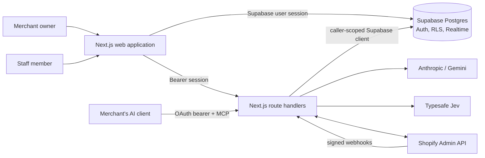

# Architecture overview

## Product model

Warmluke turns a business owner's description of work into a small operational
application. The generated application is data, not generated source code:

- modules define navigable sections;
- versioned UI schemas define fields and presentation;
- generic JSON records hold owner-managed business data;
- expression trees define computed values, actions, statistics, and automations;
- canonical commerce tables hold synchronized Shopify data.

The same application can be designed through Warmluke's built-in assistant or through
a merchant-owned AI client connected over MCP. Both paths converge on the same plan
validator and build implementation.

## System context



## Runtime responsibilities

| Boundary | Responsibilities |
| --- | --- |
| Browser | Authentication UI, dashboard, builder shell, record interaction, chat UI, import progress, Realtime subscriptions |
| Next.js route handlers | Verify bearer sessions, orchestrate AI turns and imports, expose MCP, enforce request shape, call caller-scoped database APIs |
| PostgreSQL | Tenant isolation, authorization, canonical writes, automation execution, build approval state, audit data, aggregate/stat queries |
| Model providers | Produce constrained replies, plans, gap analysis, question routing, and optional design judgement |
| Shopify | Source of canonical commerce data and change events |
| MCP client | Read store/app information and request or submit designs under the merchant's OAuth identity |

## Primary code boundaries

### Application routes

`src/app` uses the Next.js App Router. Public and authentication pages are server or
client pages as appropriate. The dashboard and builder page enter client-side
application shells. Route handlers under `src/app/api` form the server-side boundary.

The repository uses Next.js 16's `src/proxy.ts` convention—not the deprecated
`middleware.ts` name—for landing-page variant assignment.

### Domain and engine libraries

- `src/lib/types.ts`: shared domain and model-output contracts.
- `src/lib/capabilities.ts`: supported columns, views, operators, triggers, actions,
  statistics, and unsupported requests.
- `src/lib/ai.ts`: prompt construction, response parsing, validation, provider calls,
  and gap analysis.
- `src/lib/engine.ts`: a complete read-only design turn shared by chat and MCP.
- `src/lib/apply.ts`: the only application-level path from plans to builder writes.
- `src/lib/store-read.ts`: canonical, caller-scoped commerce reads.
- `src/lib/shopify-*.ts`: OAuth, resource registry, import, bulk, and webhook support.

### Database

The database owns authorization and the most sensitive invariants. RLS prevents one
tenant from seeing another. Restrictive policies prevent OAuth client tokens from
writing tables directly. Security-definer functions expose narrow operations such as
joining a project, recording a request, approving a design, importing verified Shopify
payloads, and executing an approved build.

The schema is evolutionary:

```text
supabase/schema.sql                 0001 bootstrap
supabase/migrations/0002_*.sql     first migration
...
supabase/migrations/0092_*.sql     current final migration at this checkpoint
```

`scripts/apply-migrations.mjs` maintains `public.abo_migrations` because the earliest
production history predated a migration ledger.

## Architectural invariants

1. **Models propose data, never executable business code.** Plans and expression trees
   are closed, validated contracts.
2. **A design is not a write.** `runTurn` reads context and returns a reply; application
   happens separately.
3. **The shown design is the applied design.** Blueprint plans are the actual plans, not
   prose that is regenerated after approval.
4. **All builder writes share one gateway.** First-party and MCP builds use `applyPlans`,
   which writes through `abo_build`.
5. **Authorization is database-centred.** Knowing a project or row identifier is not
   permission; RLS and security-definer checks decide access.
6. **Third-party OAuth tokens are read-only by default.** A client can build only through
   a merchant-approved request and the narrow build gateway.
7. **Store-backed sections never become second copies of Shopify data.** They render
   canonical commerce views and may add computed columns, but cannot accept invented
   stored rows.
8. **History is append-only where meaning depends on time.** Schema rollback writes a
   new version; it does not rewrite history.
9. **A failed multi-plan build is compensated.** Earlier steps are reversed where
   possible, and anything that cannot be reversed is reported.
10. **External data is not silently deleted on ambiguity.** A full Shopify recheck
    reports drift rather than deleting unmatched local rows.

## Cross-cutting concerns

### Localization and money

Projects carry a BCP-47 locale and ISO 4217 currency. Shopify amounts retain the store's
currency. Optional conversion uses a dated, database-cached exchange rate and must not
relabel a source amount with a different currency symbol.

### Observability and audit

Conversation messages preserve model replies, repair errors, build receipts, and undo
steps. Build requests preserve approval and outcome state. Judgements observe design
quality without becoming an authorization gate. Admin changes have their own audit
table. Import progress and webhook failures are stored rather than only logged.

### Realtime

The browser subscribes to relevant Supabase changes so builds initiated through MCP,
request status changes, and synchronized data become visible without requiring the same
browser process to have made the change.

## Known architectural seams

- The TypeScript and PostgreSQL expression evaluators must remain behaviorally aligned.
- A multi-plan build spans multiple PostgREST calls, so compensation provides practical
  atomicity rather than one database transaction across the whole batch.
- The built-in assistant receives a bounded store snapshot plus a routed slice, not an
  unrestricted tool loop.
- Several large client components centralize coordination. Their behavior is documented
  in [Frontend architecture](frontend.md).
- The initial schema and a few old comments describe the prototype state; current
  behavior must be read through the full migration chain.
