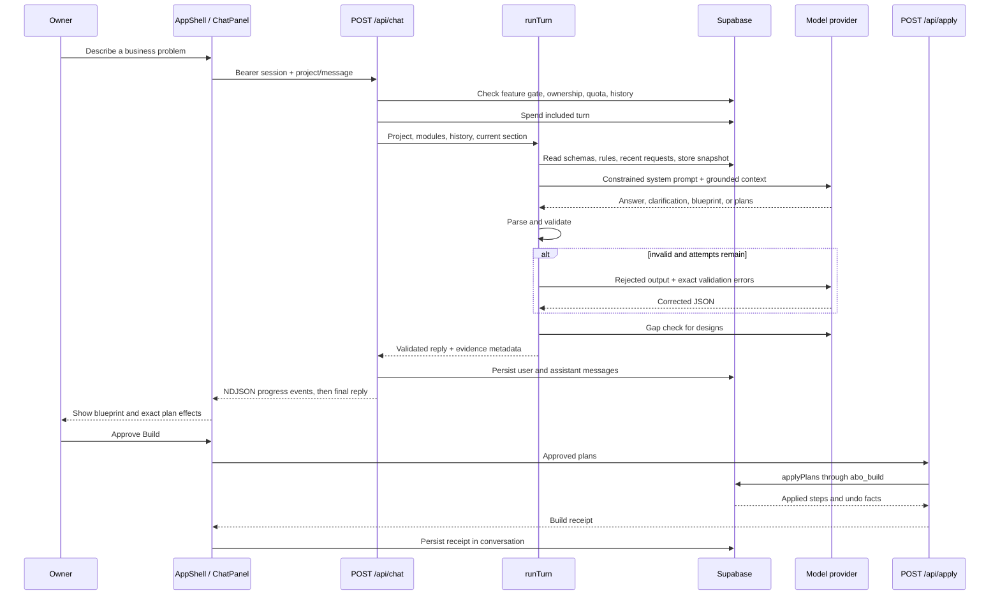
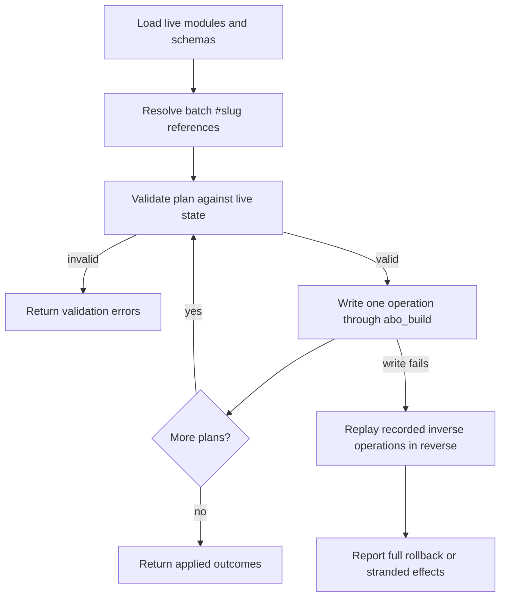
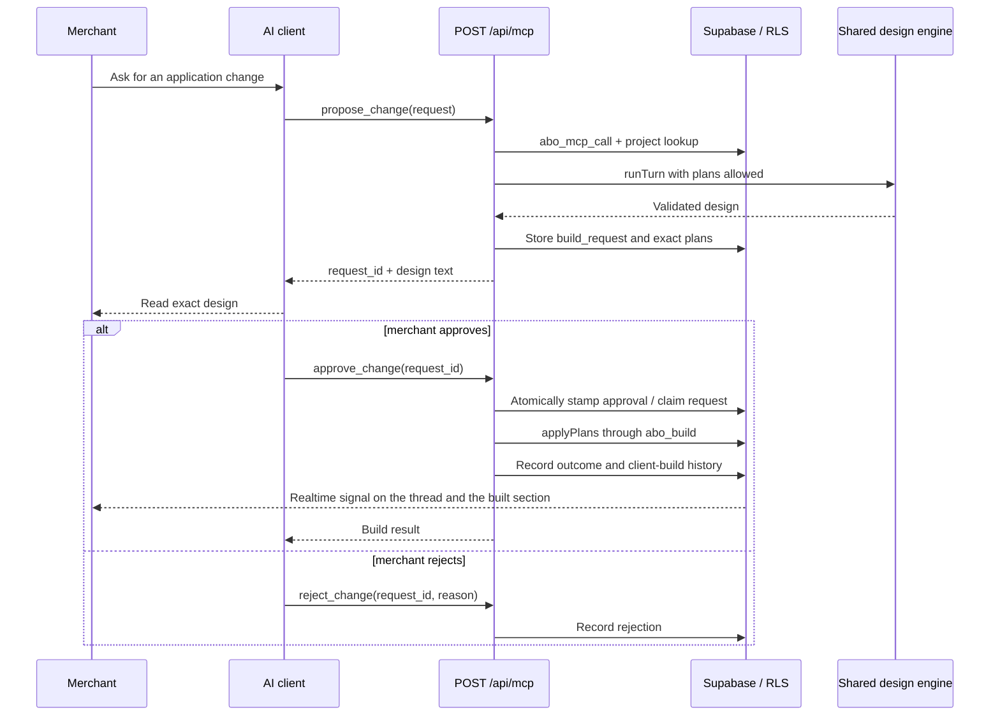
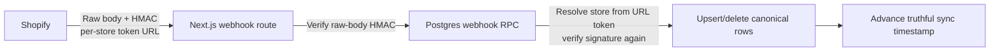

# Runtime flows

## Built-in assistant: discovery to build



`POST /api/chat` never applies a plan. Its stream contains truthful step events followed
by one final response object. The model can be retried up to two times after the initial
attempt when structural or semantic validation fails.

## Plan application and compensation



A batch is limited to six plans. Each `abo_build` call has its own transaction, so
`applyPlans` records inverse operations and compensates after a later failure. Build
outcomes report only changes that still stand.

## Undo after a completed build

The apply result records the identifiers and previous values required for a later undo.
The UI sends only the message identifier to `/api/undo`; the server reads the authorized
undo steps from that message.

- A restored schema becomes a new version.
- A module update is restored only if nobody changed it again.
- A schema restoration is refused when a newer version would be lost.
- Seeded records are deleted only when they remain untouched.
- Automation changes are restored by automation ID and previous definition.

Undo is intentionally conservative: preserving later human work is more important than
making every old build reversible.

## External assistant: propose and approve



Client-build history is written server-side into a per-project thread titled "Changes
from your AI", which also advances that conversation's `updated_at`. An open browser is
subscribed to `conversations` for the project, so the request and its receipt appear in
the chat panel as the build lands rather than at the next refresh.

The OAuth token includes a `client_id`. Restrictive policies refuse its direct table
writes. Security-definer functions allow only narrowly defined request, approval, and
build operations. A client may approve or reject only requests associated with itself;
module deletion is never allowed through this path.

## Shopify connection and initial import

```mermaid
sequenceDiagram
    participant O as Owner
    participant UI as Dashboard
    participant Install as /api/shopify/install
    participant S as Shopify
    participant Callback as /api/shopify/callback
    participant DB as Supabase
    participant Worker as /api/shopify/import/worker

    O->>UI: Enter store name or address
    UI->>Install: projectId + shop
    Install->>DB: Write pending store + expiring OAuth state
    Install-->>UI: Shopify authorization URL
    UI->>S: Redirect to authorize
    S->>Callback: code, state, shop, signed query
    Callback->>Callback: Verify query HMAC
    Callback->>S: Exchange code; read shop context
    Callback->>DB: Spend state and store tokens via abo_shopify_connect
    Callback->>S: Subscribe resource webhooks
    Callback->>DB: Record subscription errors, if any
    DB->>DB: Store connected → mint a ticket for it (abo_import_dispatch)
    DB->>Worker: pg_net: store + ticket
    Worker-->>DB: 202, then works in after()
    Callback-->>UI: Redirect to project
    loop bounded steps, renewing the ticket
        Worker->>S: Count; page or bulk-export resource
        Worker->>DB: Upsert rows and progress as the ticket
    end
    Worker->>DB: Hand over to a fresh ticket, or release when done/waiting/failed
    Worker->>DB: Advance last_synced_at after completed pass
    loop while the page is open
        UI->>DB: Status (via /api/shopify/import)
    end
```

The importer chooses paging for smaller resources and Shopify bulk operations above the
configured threshold. Each step performs bounded work so the process can run on a
serverless platform and resume after interruption. Every minute `abo_import_tick`
re-dispatches stores with work left and nobody on them, so a crashed step or a lapsed
ticket resumes from the last saved cursor. Where the database has no worker address,
the dashboard drives the same step itself through `/api/shopify/import`.

## Shopify webhook update



Compliance topics use a separate static route because Shopify requires one global URL.
The shop identity is taken from the signed body. Ordinary topics use a per-store URL so
an unsigned shop header is never treated as identity.

## Store question routing

Before the built-in model sees a merchant's question, Jev may classify its list, time
window, and intent. A confident route fetches up to 50 relevant rows. The model also
receives bounded recent orders, low stock, leaders, counts, filter values, and sync
metadata. If routing is uncertain or unavailable, the fixed snapshot remains available.
