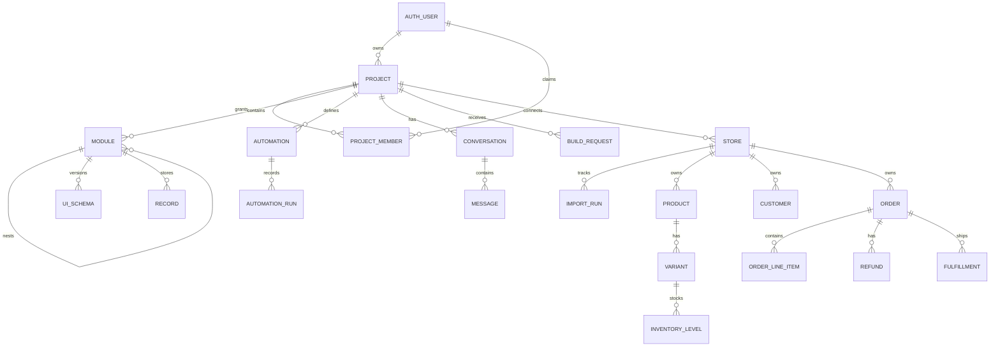

# Domain and data model

## Two storage models

Warmluke deliberately uses two kinds of business data.

### Adaptive application data

Owner-defined sections vary by business. Their rows use `records.data` JSONB and their
shape lives in a versioned UI schema. This permits a clinic, repair shop, warehouse, or
agency to use the same runtime without database migrations for every new field.

### Canonical commerce data

Shopify data has one shared meaning and must be queryable consistently. Products,
customers, orders, inventory, refunds, and shipments therefore use fixed relational
tables and security-invoker views. Generated sections point to those views through
`modules.source_table` instead of copying commerce rows into `records`.

## Core relationship model

## Adaptive application tables

| Table | Purpose | Important behavior |
| --- | --- | --- |
| `projects` | Tenant and generated application | Owner, name, locale, currency, auto-build setting |
| `project_members` | Staff seats | Claimed with a secret token; one seat per user/project |
| `modules` | Navigable application sections | Per-project slug, ordering, one-level nesting, optional store source |
| `records` | Owner-managed rows | JSONB data; project/module scoped; update timestamp supports safe undo |
| `ui_schemas` | Append-only module designs | Versioned schema JSON, author, and change description |
| `automations` | Declarative business rules | Optional module scope, enabled state, expression/action definition |
| `automation_runs` | Automation execution history | Success flag, triggering record, and details |

### UI schema

A `UiSchema` contains columns plus optional features. A column defines a field, label,
type, optional currency source, link target, and optional computed expression. Features
may define a view, search, filters, section statistics, default sort, row actions, and
scan mode.

The latest version per module is current. Earlier versions remain available for history
and restoration. Store-backed sections derive their ordinary columns from the canonical
store view and retain only their added computed columns and presentation features.

### Automation definition

An automation has one trigger and one or more actions:

- triggers: record created, record updated, or scheduled;
- actions: set fields on self/matching rows or create a record in another module.

The TypeScript contract includes a webhook action for historical compatibility, but the
platform capability registry advertises only implemented/accepted actions. Treat
`capabilities.ts` and validator behavior as the supported surface.

Expressions are trees of literals, current-row fields, prior values, target-row values,
and closed-set operators. PostgreSQL evaluates automations; the browser evaluates
computed columns, guards, and local display behavior where allowed.

## Conversation and build tables

| Table | Purpose |
| --- | --- |
| `conversations` | Owner-only assistant threads, including the per-project thread external builds are filed in; published to realtime, and every message writer advances `updated_at` |
| `messages` | Original model content plus structured reply/build/undo payloads; `payload.superseded` marks a prompt the merchant later corrected, and everything answered after it |
| `build_requests` | Designs originating from MCP clients, including status, exact plans, approval, outcome, and source client |
| `judgements` | Asynchronous design-quality observations; never an authorization decision |
| `mcp_calls` | Per-user/client usage accounting and throttling |
| `account_settings` | Feature switches, turn allowances, and superadmin state |
| `profiles` | One row per account: onboarding answers (name, business, role, monthly orders, platform, optional website/team size/source) and `onboarded_at`, which only the database stamps and which cannot be unset |
| `admin_account_audit` | Audit trail for administrator account changes |
| `account_invites` | Sign-up links an administrator makes: a 192-bit token, what is known of the person (email, name, business), uses allowed, `expires_at` (72 hours unless chosen), `revoked_at`; closed to every key, read and written only through `abo_admin_invite*` and `abo_invite_peek`/`abo_invite_claim` (0119) |
| `account_invite_claims` | Who took each invite, one row per account and invite |
| `demo_followups` | One row per demo request an administrator has touched: its stage (new, contacted, scheduled, customer, not_a_fit) and a private note; written only through `abo_admin_demo_follow_up`, against the version last seen (0120) |

Build request state evolved across migrations. Current code recognizes `pending`,
`opened`, `building`, `dismissed`, `built`, and `partly_built`. Do not
derive the current state machine from migration `0029` alone; later migrations extend
both columns and allowed states.

## Commerce tables and views

| Table | Meaning |
| --- | --- |
| `stores` | One provider account per project, OAuth token lifecycle, shop context, sync state |
| `import_runs` | Cursor/bulk-operation progress for each resource |
| `products` | Shopify products |
| `collections` | Merchant-made groupings, with Shopify's own count of what is in each |
| `collection_products` | Which products belong to which collection |
| `variants` | Product variants, SKU/barcode/price, unit cost and whether Shopify tracks their stock |
| `inventory_levels` | Per variant/location: available to sell, on hand, committed to orders, and incoming |
| `locations` | Each place the shop stocks or ships from, whether it is open, and where it is; kept when Shopify removes one |
| `customers` | Customer identity, contact, location, spend, and order count |
| `abandoned_checkouts` | Baskets left at the checkout, with the recovery link. Holds personal data, so redaction erases it and a trigger refuses it back |
| `orders` | Order identity, timestamps, gross/current totals and their parts (goods, tax, shipping, discount), statuses, payment/discount/shipping facts |
| `order_line_items` | Quantity, product/variant links, SKU, and unit price |
| `refunds` | Refunded amount, units, and timestamp |
| `order_transactions` | What money actually did: kind, status, gateway, amount, and whether it was a test |
| `fulfillments` | Shipment status, carrier, tracking, and delivery timestamps |
| `shopify_data_requests` | Compliance request audit |
| `shopify_redactions` | Tombstones that prevent deleted customer data from reappearing |

Security-invoker views expose stable section shapes such as orders, customers, products,
inventory, product sales, order items, refunds, variants, fulfillments, and transactions. The current
registry and view mapping in `store-read.ts` are authoritative for names exposed to the
application.

## Supporting tables

- `fx_rates`: project-scoped currency conversion cache.
- `landing_events`: rate-limited marketing attribution and conversion events. A demo
  booking is one of them (`demo_booked`, the answers in `payload`), read only by
  administrators through `abo_admin_demo_requests` (0115), with where each stands
  (`demo_followups`, 0120).
- `app_secrets`: server-side integration secrets used by database verification paths.
- `abo_migrations`: repository-managed migration ledger created by the migration runner.

The browser and server currently assume at most one active store per project and use
single-row queries. The database uniquely claims a connected shop domain globally but
does not enforce uniqueness on `stores.project_id`; treat the one-store rule as a current
application invariant and a schema seam, not a relational guarantee.

## Ownership and deletion

- Deleting a project cascades its generated application, conversations, build requests,
  connected store, and commerce data.
- Deleting a module cascades its records and schema versions; the UI requires explicit
  name confirmation and reports dependent child sections/records first.
- Disconnecting a store deletes imported local commerce data but does not change Shopify.
- Compliance redaction is destructive by contract and records tombstones so later
  imports cannot recreate erased personal data.

## Migration source of truth

To reconstruct a new database, apply `supabase/schema.sql` as version `0001`, then every
`supabase/migrations/NNNN_*.sql` in numeric order. Never edit an already-applied
migration to change production behavior; add the next numbered migration and update the
checks that prove its invariant.
