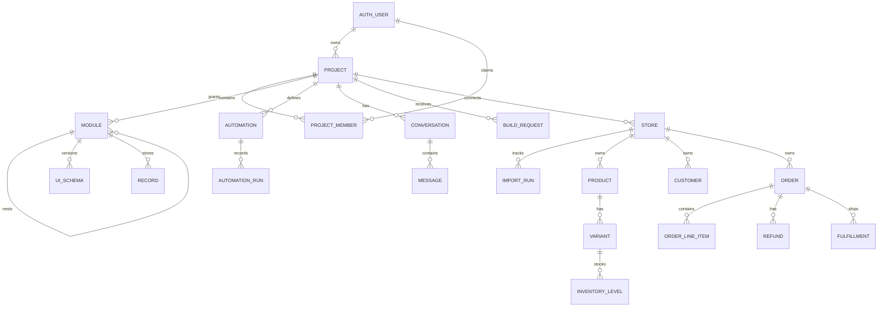

# Domain and data model

## Two storage models

Warmluke deliberately uses two kinds of business data.

### Adaptive application data

Owner-defined sections vary by business. Their rows use `records.data` JSONB and their
shape lives in a versioned UI schema. This permits a clinic, repair shop, warehouse, or
agency to use the same runtime without database migrations for every new field.

### Canonical commerce data

Shopify data has one shared meaning and must be queryable consistently. Products,
customers, orders, inventory, refunds, and shipments therefore use fixed relational
tables and security-invoker views. Generated sections point to those views through
`modules.source_table` instead of copying commerce rows into `records`. What the merchant
fills in beside a store row is a record of that section with `store_row_id`, the row's own
id (0128): one per row per section (a unique index), always set on a store section's
records, to a row of that project's own store, and never on an own section's (a trigger),
and never touched by an import. Rules on a store section fire on the merchant's changes,
from the first field kept on a row, or on a schedule that walks the store's list (0130: a row
the rule acts on gets its record then); when a rule is judged the store's row is laid under
the record (`abo_store_row`), so it reads the store's fields and writes only the merchant's.
Stats count the store's rows with those fields beside them.

## Core relationship model

```mermaid
erDiagram
    AUTH_USER ||--o{ PROJECT : owns
    AUTH_USER ||--o{ PROJECT_MEMBER : claims
    PROJECT ||--o{ PROJECT_MEMBER : grants
    PROJECT ||--o{ MODULE : contains
    MODULE ||--o{ MODULE : nests
    MODULE ||--o{ UI_SCHEMA : versions
    MODULE ||--o{ RECORD : stores
    PROJECT ||--o{ AUTOMATION : defines
    AUTOMATION ||--o{ AUTOMATION_RUN : records
    PROJECT ||--o{ CONVERSATION : has
    CONVERSATION ||--o{ MESSAGE : contains
    PROJECT ||--o{ BUILD_REQUEST : receives
    PROJECT ||--o{ STORE : connects
    STORE ||--o{ IMPORT_RUN : tracks
    STORE ||--o{ PRODUCT : owns
    PRODUCT ||--o{ VARIANT : has
    VARIANT ||--o{ INVENTORY_LEVEL : stocks
    STORE ||--o{ CUSTOMER : owns
    STORE ||--o{ ORDER : owns
    ORDER ||--o{ ORDER_LINE_ITEM : contains
    ORDER ||--o{ REFUND : has
    ORDER ||--o{ FULFILLMENT : ships
```

## Adaptive application tables

| Table                  | Purpose                                                                                                                                                                | Important behavior                                                                                                                                                                                                                                                                                                                                  |
| ---------------------- | ---------------------------------------------------------------------------------------------------------------------------------------------------------------------- | --------------------------------------------------------------------------------------------------------------------------------------------------------------------------------------------------------------------------------------------------------------------------------------------------------------------------------------------------- |
| `projects`             | Tenant and generated application                                                                                                                                       | Owner, name, locale, currency, auto-build setting                                                                                                                                                                                                                                                                                                   |
| `project_members`      | Staff seats                                                                                                                                                            | Claimed with a secret token that lapses after 7 days; one seat per user/project; `can_see_store` (off for new seats) opens the store's rows; `last_seen_at` for the owner's People tab (0140); `can_build` (off for new seats) lets them build sections of their own with Luke and their own AI, paid from the owner's included designs (0146)      |
| `module_shares`        | Which seats a section is shared with (0140)                                                                                                                            | Written by the owner, or by whoever built the section (0146); a section shared with the team (`modules.shared_with_team`) needs none; a section under another is shared as its parent is                                                                                                                                                            |
| `module_hides`         | A section hidden from one seat (0145)                                                                                                                                  | Wins over the team, a share and having built it; `hidden_by` (0146): a builder lifts only their own hides, never the owner's. `modules.created_by` (0145) is who built it, from the session; `abo_may_change_module` is the owner, or its builder while `can_build` is on and it is not hidden from them                                            |
| `modules`              | Navigable application sections                                                                                                                                         | Per-project slug, ordering, one-level nesting, optional store source                                                                                                                                                                                                                                                                                |
| `records`              | Owner-managed rows, and the merchant's own fields beside a store row                                                                                                   | JSONB data; project/module scoped; update timestamp supports safe undo; the app changes a row through `abo_record_patch` (0149): only the fields sent, in one locked step, refused with what they are now when they changed since they were seen; `store_row_id` names the store row on a store section (0128)                                      |
| `merchant_notes`       | What Luke learned about the business from its owner (0131)                                                                                                             | One line each, per project; unique per project; the newest forty kept by a trigger; read into the plan and talk prompts; struck by the owner, and read by nobody else (0140)                                                                                                                                                                        |
| `turn_traces`          | What each of Luke's turns did (0132)                                                                                                                                   | One row a turn: steps, road, model, usage, repairs and their errors, unmet, plan goal, critic verdict, time taken; read by the project's owner (0140)                                                                                                                                                                                               |
| `luke_skills`          | What Luke learned for one project (0176): a lesson (a mistake not to repeat, or the owner's way) or a skill (a procedure that worked)                                  | Title, when to use it, body; status active, retired or struck; version and counters (uses, helped, hurt); one active title per project; thirty active at most, a trigger retiring the weakest (helped minus hurt, then the longest untouched) and logging it; the owner's alone, as `merchant_notes` is since 0140 (a teammate's turn reads none)   |
| `row_approvals`        | A teammate's press of a row button marked `approval` (0183), waiting for the owner                                                                                     | The button, the row (record or store row) and its name, what it would set, who asked and when; status waiting, approved, declined or stale; read by whoever can use the project, written only through `abo_ask_approval` (a teammate's press) and `abo_decide_approval` (the owner alone, never an AI's token); one waiting a row and a button      |
| `design_examples`      | Kept designs proposed as examples for Luke (0181), in words only: what was asked (numbers, phones and orders taken out), what was built, why, the words it is found by | Status proposed, active or retired; the build it came from, never read by Luke; no direct access at all: Luke reads the active ones' words through `abo_design_examples`, and only an administrator proposes, approves or retires one, through `abo_admin_*` functions                                                                              |
| `luke_learning_events` | The append-only timeline of what happened to a lesson (0176)                                                                                                           | created, patched, used, helped, hurt, retired, struck or repeat (a mistake made again), with a detail, the thread and turn; kept when its lesson is deleted; and `reflected`, one row each time the reflector runs, kept or not, with why, what it kept, its model and its dollars (it runs after the turn is priced); same access as `luke_skills` |
| `reply_feedback`       | An owner's thumbs up or down on one of Luke's replies (0176)                                                                                                           | One verdict a person a reply, with an optional note; each person reads and writes only their own, and only on a reply of that project                                                                                                                                                                                                               |
| `screen_errors`        | A written screen that broke while it ran (0178): its own error or a call the app refused                                                                               | Project, section, the screen's title, the message, who had it open; written by the app once a message a visit, read only by the console's Needs a look                                                                                                                                                                                              |
| `ui_schemas`           | Append-only module designs                                                                                                                                             | Versioned schema JSON, author, and change description                                                                                                                                                                                                                                                                                               |
| `automations`          | Declarative business rules                                                                                                                                             | Optional module scope, enabled state, expression/action definition                                                                                                                                                                                                                                                                                  |
| `automation_runs`      | Automation execution history                                                                                                                                           | Success flag, triggering record, and details                                                                                                                                                                                                                                                                                                        |
| `code_jobs`            | Code rules waiting to run with nobody watching (0134)                                                                                                                  | Kind `schedule` or `added` (the store rows it is for), status, tries, why it failed; one open job a rule and kind; read by the project's members, written by the database and the project's ticket                                                                                                                                                  |
| `code_leases`          | The code worker's lock and ticket (0134)                                                                                                                               | One row a project while a worker holds it: the ticket's hash and when it lapses; no client reads it                                                                                                                                                                                                                                                 |

### UI schema

A `UiSchema` contains columns plus optional features. A column defines a field, label,
type, optional currency source, link target, and optional computed expression. Features
may define a view, search, filters, section statistics, default sort, row actions, and
scan mode.

The latest version per module is current. Earlier versions remain available for history
and restoration. Store-backed sections derive their ordinary columns from the canonical
store view and retain only their added computed columns and presentation features.

### Automation definition

An automation has one trigger and one or more actions:

- triggers: record created, record updated, scheduled, or, for a code rule on a section
  over the store, a row the store brings in (`store_row_added`);
- actions: set fields on self/matching rows or create a record in another module, run
  the rule's own code (`run_code`), or an AI step (`ai_fill`, 0182) that reads fields of
  the row and fills others.

A section's rules run in the order they were made, on a change and on the clock alike;
when two write one field on one change, the newer one's value stands (0135).

A rule writing a section over the store (0133) finds the store's row by one of the store's
own fields and keeps what it writes beside that row (a record with `store_row_id`, as
0128), never in the store's own list. `run_code` is not run by the database: the app runs
it after its own write (`src/lib/code-rules.ts`), and on a schedule or a row the store
brings in through the queue below (0134).

`ai_fill` is not run by the database either. The app runs it after a row is added or
changed (`runFill` in `src/lib/code-rules.ts`), on the fill model (`ANTHROPIC_FILL_MODEL`).
It fills only fields still empty, with one of a field's own choices or a short value
taken out of the words (`src/lib/ai-fill.ts`). It never fills a link, a yes/no or a
worked-out field, and never overwrites what the owner typed.

Each run is a line in the rule's own history (`automation_runs`, its `detail` saying
`ai`, what it filled, what it left, the model and the dollars). A project may run 200 a
day (UTC); past that `abo_ai_fill_claim` starts none and raises the rule's bell alert
once that day.

The TypeScript contract includes a webhook action for historical compatibility, but the
platform capability registry advertises only implemented/accepted actions. Treat
`capabilities.ts` and validator behavior as the supported surface.

Expressions are trees of literals, current-row fields, prior values, target-row values,
and closed-set operators. PostgreSQL evaluates automations; the browser evaluates
computed columns, guards, and local display behavior where allowed.

## Conversation and build tables

| Table                   | Purpose                                                                                                                                                                                                                                                                                                                                  |
| ----------------------- | ---------------------------------------------------------------------------------------------------------------------------------------------------------------------------------------------------------------------------------------------------------------------------------------------------------------------------------------- |
| `conversations`         | Assistant threads, each its `created_by`'s (0146): the owner reads all of them, a seat with `can_build` only its own; including the per-project thread external builds are filed in; published to realtime, and every message writer advances `updated_at`. Named by Luke's replies until the owner renames one (`named_by_owner`, 0126) |
| `messages`              | Original model content plus structured reply/build/undo payloads; `payload.superseded` marks a prompt the merchant later corrected, and everything answered after it                                                                                                                                                                     |
| `build_requests`        | Designs originating from MCP clients, including status, exact plans, approval, outcome, and source client                                                                                                                                                                                                                                |
| `judgements`            | Asynchronous design-quality observations; never an authorization decision                                                                                                                                                                                                                                                                |
| `mcp_calls`             | Per-user/client usage accounting and throttling; since 0180 the guide's version, the call's outcome and how many problems it listed (the console's Their AI)                                                                                                                                                                             |
| `account_settings`      | Feature switches, turn allowances, superadmin state, and which models Luke may use and what each reply shows (`luke_models`, `luke_shows`, 0127)                                                                                                                                                                                         |
| `profiles`              | One row per account: onboarding answers (name, business, role, monthly orders, platform, optional website/team size/source) and `onboarded_at`, which only the database stamps and which cannot be unset                                                                                                                                 |
| `admin_account_audit`   | Audit trail for administrator account changes                                                                                                                                                                                                                                                                                            |
| `account_invites`       | Sign-up links an administrator makes: a 192-bit token, what is known of the person (email, name, business), uses allowed, `expires_at` (72 hours unless chosen), `revoked_at`; closed to every key, read and written only through `abo_admin_invite*` and `abo_invite_peek`/`abo_invite_claim` (0119)                                    |
| `account_invite_claims` | Who took each invite, one row per account and invite                                                                                                                                                                                                                                                                                     |
| `signup_gate`           | One row: `invite_only`, switched by an administrator (`abo_admin_set_invite_only`), and when it went on. On, a new account starts an app only with a claimed invite (`abo_may_start_app`, a restrictive insert policy on `projects`); older accounts, owners and team seats are unaffected, and signing in never is (0141)               |
| `demo_followups`        | One row per demo request an administrator has touched: its stage (new, contacted, scheduled, customer, not_a_fit) and a private note; written only through `abo_admin_demo_follow_up`, against the version last seen (0120)                                                                                                              |

Build request state evolved across migrations. Current code recognizes `pending`,
`opened`, `building`, `dismissed`, `built`, and `partly_built`. Do not
derive the current state machine from migration `0029` alone; later migrations extend
both columns and allowed states.

## Commerce tables and views

| Table                   | Meaning                                                                                                                                                                                                                                                                                                                                                                                                                                                    |
| ----------------------- | ---------------------------------------------------------------------------------------------------------------------------------------------------------------------------------------------------------------------------------------------------------------------------------------------------------------------------------------------------------------------------------------------------------------------------------------------------------- |
| `stores`                | One provider account per project, OAuth token lifecycle, shop context, sync state                                                                                                                                                                                                                                                                                                                                                                          |
| `import_runs`           | Cursor/bulk-operation progress for each resource                                                                                                                                                                                                                                                                                                                                                                                                           |
| `products`              | Shopify products; `store_products` adds the collections and when each last sold, empty if never (0170), so "not sold in N days" is one rule                                                                                                                                                                                                                                                                                                                |
| `collections`           | Merchant-made groupings, with Shopify's own count of what is in each                                                                                                                                                                                                                                                                                                                                                                                       |
| `collection_products`   | Which products belong to which collection                                                                                                                                                                                                                                                                                                                                                                                                                  |
| `variants`              | Product variants, SKU/barcode/price, unit cost and whether Shopify tracks their stock                                                                                                                                                                                                                                                                                                                                                                      |
| `inventory_levels`      | Per variant/location: available to sell, on hand, committed to orders, and incoming                                                                                                                                                                                                                                                                                                                                                                        |
| `locations`             | Each place the shop stocks or ships from, whether it is open, and where it is; kept when Shopify removes one                                                                                                                                                                                                                                                                                                                                               |
| `customers`             | Customer identity, contact, location, spend, and order count                                                                                                                                                                                                                                                                                                                                                                                               |
| `abandoned_checkouts`   | Baskets left at the checkout, with the recovery link. Holds personal data, so redaction erases it and a trigger refuses it back                                                                                                                                                                                                                                                                                                                            |
| `orders`                | Order identity, timestamps, gross/current totals and their parts (goods, tax, shipping, discount), statuses, payment/discount/shipping facts; its own, delivery and billing phones (0166), which `store_orders` shows before the customer's, with `placed_ts` to order by and `phone_digits` to search by; `customers.order_phone` keeps the newest phone on a customer's orders; `store_orders.customer_email` is the customer's email, lower case (0173) |
| `order_line_items`      | Quantity, product/variant links, SKU, and unit price                                                                                                                                                                                                                                                                                                                                                                                                       |
| `refunds`               | Refunded amount, units, and timestamp                                                                                                                                                                                                                                                                                                                                                                                                                      |
| `order_transactions`    | What money actually did: kind, status, gateway, amount, and whether it was a test                                                                                                                                                                                                                                                                                                                                                                          |
| `fulfillments`          | Shipment status, carrier, tracking, and delivery timestamps                                                                                                                                                                                                                                                                                                                                                                                                |
| `shopify_data_requests` | Compliance request audit                                                                                                                                                                                                                                                                                                                                                                                                                                   |
| `shopify_redactions`    | Tombstones that prevent deleted customer data from reappearing                                                                                                                                                                                                                                                                                                                                                                                             |

Security-invoker views expose stable section shapes such as orders, customers, products,
inventory, product sales, order items, refunds, variants, fulfillments, and transactions. The current
registry and view mapping in `store-read.ts` are authoritative for names exposed to the
application.

## Alert tables

What Luke noticed in a store (0163), worked out in the database from the canonical rows; no
model is called to find one.

- `alert_kinds`: what can be noticed, the imports each needs (`needs`), the function that
  finds it (`check_fn`, returning `subject`, `severity`, `facts`), and its default settings.
  A kind raises nothing until every import it needs is `done`; a new source is a row and a
  function.
- `alert_settings`: a project's own switch and numbers per kind, over the defaults, changed
  by a builder through `abo_set_alert_setting`.
- `alerts`: one row per `(store, kind, subject)`. It opens, its facts move without ringing
  again, `changed_at` moves when it opens again or turns critical, it resolves when its check
  no longer finds it, and opens fresh (with no thread) if it comes back. `conversation_id` is
  Luke's thread about it. Readable where the store is (`abo_can_open_store`); written only
  by the definer functions.
- Kind `rule` (0164) has no check: a rule's `alert` action raises it, with `automation_id`
  (deleted with the rule), `raised_at` (a schedule closes what it did not raise again) and
  no `store_id` needed; unique per `(automation_id, subject)`. Seen by whoever sees the
  rule's section (`abo_can_see_alert`).
- `alert_reads`: each person's read and put-away, against `changed_at`.
- `alert_dirty`: stores whose rows changed, looked at again within a minute by
  `abo_alerts_run_dirty`; every store is looked at every fifteen minutes (`abo_alerts_run`).

## Supporting tables

- `fx_rates`: project-scoped currency conversion cache.
- `landing_events`: rate-limited marketing attribution and conversion events. An
  early-access request is one of them (`demo_booked`, the answers in `payload`, the business
  among them since 0141), read only by
  administrators through `abo_admin_demo_requests` (0115), with where each stands
  (`demo_followups`, 0120).
- `app_secrets`: server-side integration secrets used by database verification paths.
- `abo_migrations`: repository-managed migration ledger created by the migration runner.

The browser and server currently assume at most one active store per project and use
single-row queries. The database uniquely claims a connected shop domain globally but
does not enforce uniqueness on `stores.project_id`; treat the one-store rule as a current
application invariant and a schema seam, not a relational guarantee.

## Ownership and deletion

- Deleting a project cascades its generated application, conversations, build requests,
  connected store, and commerce data.
- Deleting a module cascades its records and schema versions; the UI requires explicit
  name confirmation and reports dependent child sections/records first.
- Disconnecting a store deletes imported local commerce data but does not change Shopify.
- Compliance redaction is destructive by contract and records tombstones so later
  imports cannot recreate erased personal data.

## Migration source of truth

To reconstruct a new database, apply `supabase/schema.sql` as version `0001`, then every
`supabase/migrations/NNNN_*.sql` in numeric order. Never edit an already-applied
migration to change production behavior; add the next numbered migration and update the
checks that prove its invariant.
